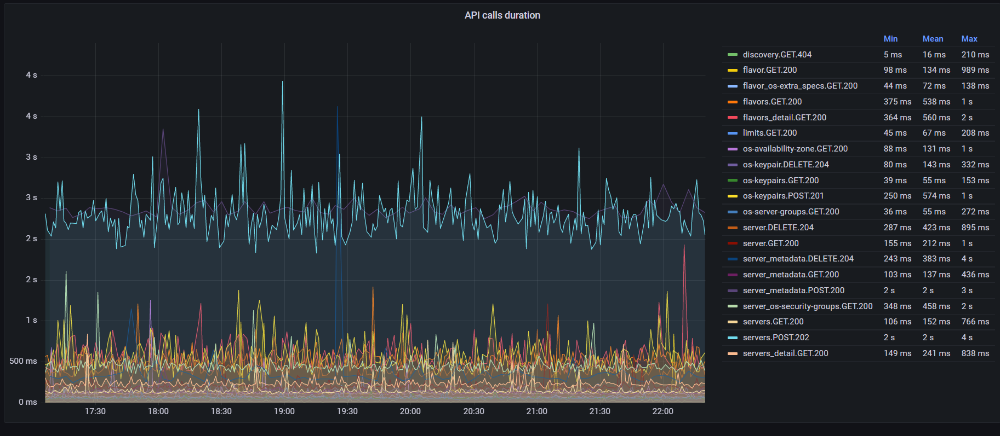

=====================================================================================
OIS 2022 - SDK forum -  Solve Ops challenges in a Dev way for Starters with OpenStack
=====================================================================================

Challenge 1 - Provisioning - Openstack SDK
==========================================

* Infrastructure as a code
* Inventory
* Desired state of infrastructure
* Full cloud capabilities
* Flexibility

Provisioning VM with SDK
------------------------

.. code-block:: python

  import openstack, base64, random

  conn = openstack.connect()
  FLAVOR_NAME = 's3.medium.1'
  KEY_NAME = 'keypair-linux'
  SERVER_NAME = 'server'
  IMAGE_NAME = 'Standard_Fedora_35_latest'
  NETWORK_NAME = 'network-linux'
  AZ = ['eu-de-01', 'eu-de-02', 'eu-de-03']
  image = conn.compute.find_image(IMAGE_NAME)
  flavor = conn.compute.find_flavor(FLAVOR_NAME)
  network = conn.network.find_network(NETWORK_NAME)

  userdata = '''#!/bin/bash
  mkdir /opt/data; mkfs.ext4 -L data /dev/vdb
  echo "LABEL=data   /opt/data   auto   defaults,comment=userdata 0 2" >> /etc/fstab
  mount /opt/data
  '''
  userdata = userdata.encode('utf-8', 'strict')
  userdata_encoded = base64.b64encode(userdata).decode('utf-8')

  for count in range(10):
      az = random.choice(AZ)
      server = conn.compute.create_server(
               flavor_id=flavor.id,
               image_id=image.id,
               networks=[{"uuid": network.id}],
               availability_zone=az,
               user_data=userdata_encoded,
               key_name=KEY_NAME,
               block_device_mapping=[{"volume_size": 5, "source_type": "blank",
                                      "destination_type": "volume"}],
               name=SERVER_NAME+'-'+str(count)
      )
      server = conn.compute.wait_for_server(server)
      print('Server ' + server.name + ' created in ' + az)

Challenge 2 - Monitoring
========================

* API monitoring
* What metrics to collect
* What tools to use

Metrics collection with Openstack SDK
-------------------------------------

openstacksdk can report statistics on individual API requests/responses in several different formats:

* statsd
* influxDB
* prometheus 

Configuration examples can be found at https://docs.openstack.org/openstacksdk/latest/user/guides/stats.html

Configuration example
---------------------

.. code-block:: yaml

  metrics:
  statsd:
    host: 127.0.0.1
    port: 8125
    prefix: openstack.api
  clouds:
    mycloud:
      auth:
        auth_url: https://mycloud.example.com:/v3
        project_name: myproject
        username: admin
        domain_name: mytenant
      region_name: europe
  

Sample metrics
--------------

.. code-block:: bash

  Flushing stats at  Tue May 31 2022 21:29:36 GMT+0000 (Coordinated Universal Time)
  { counters:
     { 'statsd.bad_lines_seen': 0,
       'statsd.packets_received': 1,
       'statsd.metrics_received': 3,
       'openstack.api.identity.GET.projects.200': 1,
       'openstack.api.identity.GET.projects.attempted': 1 },
    timers: { 'openstack.api.identity.GET.projects.200': [ 15 ] },
    gauges: { 'statsd.timestamp_lag': 0 },
    timer_data:
     { 'openstack.api.identity.GET.projects.200':
        { count_90: 1,
          mean_90: 15,
          upper_90: 15,
          sum_90: 15,
          sum_squares_90: 225,
          std: 0,
          upper: 15,
          lower: 15,
          count: 1,
          count_ps: 0.1,
          sum: 15,
          sum_squares: 225,
          mean: 15,
          median: 15 } },
    counter_rates:
     { 'statsd.bad_lines_seen': 0,
       'statsd.packets_received': 0.1,
       'statsd.metrics_received': 0.3,
       'openstack.api.identity.GET.projects.200': 0.1,
       'openstack.api.identity.GET.projects.attempted': 0.1 },
    sets: {},
    pctThreshold: [ 90 ] }

Example Grafana Dashboard
-------------------------

Challenge 3 - Logging
=====================

* Troubleshooting
* Risk of potential  sensitive data leak
* Lack of SDK log collection in Ansible

Pull Request: https://review.opendev.org/c/openstack/ansible-collections-openstack/+/844559

Module specific log settings
----------------------------

.. code-block:: yaml

   - hosts: localhost
     module_defaults:
       openstack.cloud.image_info:
         sdk_log_path: /home/linux/data/ansible-logging/os-sdk.log
         sdk_log_level: DEBUG
     tasks:
       - name: List images
         openstack.cloud.image_info:

Challenge 4 - Decommission (cleanup of resources)
=================================================

* Orphans
* Deletion dependencies
* Cleanup parameters
* Potential higher costs

Project cleanup SDK
-------------------

https://docs.openstack.org/python-openstackclient/latest/cli/command-objects/project-cleanup.html

.. code-block:: python

  import openstack
  import queue
  import time

  # openstack.enable_logging(debug=True)

  conn = openstack.connect()

  status_queue = queue.Queue()
  conn.project_cleanup(dry_run=True, status_queue=status_queue,
                       filters={'created_at': '2020-07-29T19:00:00Z'}
                      )
  time.sleep(5)
  while not status_queue.empty():
      resource = status_queue.get_nowait()
      print('Deleting %s %s %s' % (type(resource),resource.name, resource.id))
  inp = input('Are you sure?')
  if inp == 'yes':
      conn.project_cleanup(dry_run=False, status_queue=status_queue,
                           filters={'created_at': '2020-07-29T19:00:00Z'}

Project cleanup OSC
-------------------

.. code-block:: bash

  $ openstack project  cleanup --dry-run --created-before 2022-04-18R0024:00:00 --auth-project

Challenge 5 - Batch processing (scripts)
========================================

* Flexibility
* Combination of different scoped tokens and different cloud resources
* Manipulation with objects
* Effective batch processing tasks

Do you need to create a batch of users from a CSV file?
-------------------------------------------------------

Users CSV
---------

.. code-block:: bash

  $ cat users.txt
  username,full name,initial password,email address,user group
  jdily,John Dily,PleaseChangeMe123,John.Dily@example.com,power_user
  sring,Sam Ring,PleaseChangeMe123,Sam.Ring@example.com,admin
  fcruger,Freddy Cruger,PleaseChangeMe123,Freddy.Cruger@example.com,read_only
  ntekon,Nils Tekon,PleaseChangeMe123,Nils.Tekon@example.com,power_user
  jdaniels,Josh Daniels,PleaseChangeMe123,Josh.Daniels@example.com,admin
  sconnors,Sinead Connors,PleaseChangeMe123,Sinead.Connors@example.com,read_only
  jrambo,John Rambo,PleaseChangeMe123,John.Rambo@example.com,power_user
  epresley,Elvis Presley,PleaseChangeMe123,Elvis.Presley@example.com,admin
  kjung,Karl Jung,PleaseChangeMe123,Karl.Jung@example.com,read_only
  dhors,Dennis Hors,PleaseChangeMe123,Dennis.Hors@example.com,power_user

Users python SDK
----------------

.. code-block:: python

  $ cat users.py
  import openstack
  import csv
 
  conn = openstack.connect('domain-scoped')

  with open('users.txt') as csv_file:
      csv_reader = csv.reader(csv_file, delimiter=',')
      line_count = 0
      for row in csv_reader:
          if line_count == 0:
              line_count += 1
              pass
          else:
              conn.identity.create_user(name=row[0], decription=row[1],
                                        password=row[2], email=row[3])
              conn.add_user_to_group(row[0], row[4])
              line_count += 1
      print(f'Processed {line_count-1} lines.')

Would you like to assess the amount of disk space used up by each of your projects?
-----------------------------------------------------------------------------------

.. code-block:: python

  import openstack
  conn = openstack.connect('demo')
  projects=conn.identity.projects()
  for project in projects:
    quota=conn.block_storage.get_quota_set(project, usage=True)
    used_storage=str(quota.usage['gigabytes'])
    total_storage=str(quota.gigabytes)
    print('; '.join(['Project Name: ' + project.name,
                     'Used Quota: ' + used_storage, 'Total Quota: ' + total_storage]))

Would you like to assess the amount of disk space used up by each of your projects in all domains?
--------------------------------------------------------------------------------------------------

.. code-block:: python

  import openstack
  conn = openstack.connect('demo')
  domains=conn.identity.domains()
  for domain in domains:
    projects=conn.identity.projects(domain_id=domain.id)
    for project in projects:
      quota=conn.block_storage.get_quota_set(project, usage=True)
      used_storage=str(quota.usage['gigabytes'])
      total_storage=str(quota.gigabytes)
      print('; '.join(['Domain Name: ' + domain.name, 'Project Name: ' + project.name,
                       'Used Quota: ' + used_storage, 'Total Quota: ' + total_storage]))

Are all floating IPs are covered by security groups?
----------------------------------------------------

.. code-block:: python

  import openstack
  conn = openstack.connect('adminx')

  conn = openstack.connect('adminx')
  for floating_ip in conn.network.ips():
    if floating_ip.name.startswith('80.158') and floating_ip.port_id:
      port=conn.network.get_port(floating_ip.port_id)
      security_groups=port.security_group_ids
      print(floating_ip.name,security_groups,port.device_owner)

Who has allocated floating IPs but not using it?
-----------------------------------------------

.. code-block:: python

  import openstack
  conn = openstack.connect('project')
  fip={}
  for floating_ip in conn.network.ips():
    if floating_ip.name.startswith('80.158')
      and not floating_ip.port_id:
        fip[floating_ip.id] = {'project_id': floating_ip.project_id,
                               'fip_id': floating_ip.id,
                               'fip_status': floating_ip.status,
                               'fip_address': floating_ip.name }
  conn = openstack.connect('domain')
  for key, value in fip.items():
    try:
      project=conn.identity.find_project(value['project_id'])
      domain=conn.identity.get_domain(project.domain_id)
      print(';'.join([domain.name, domain.id,
                      value['project_id'], value['fip_id'],
                      value['fip_status'], value['fip_address']]))
    except Exception:
      print('cannot find domain for EIP: %s %s' % (key, value))
